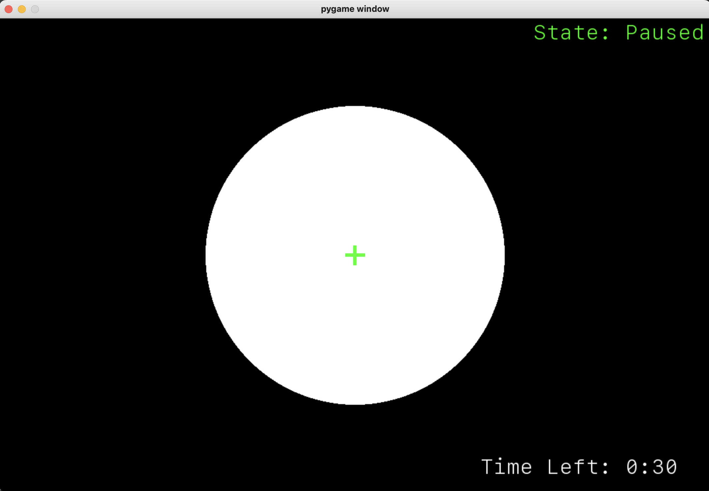

# Alpha Brain

A real-time neurofeedback game that trains your brain to produce alpha brainwaves — the electrical signature of relaxed, focused attention. Connect a Muse EEG headband, stare at the crosshairs, and watch a circle shrink as your alpha power rises.



---

## Why This Is Interesting

Consumer EEG hardware is notoriously noisy. This project cuts through that noise with a signal-processing pipeline that:

- Streams raw EEG over **Lab Streaming Layer (LSL)** from a Muse headband via Bluetooth
- Applies a **notch filter** to remove 60 Hz power-line interference
- Computes **band powers** (delta, theta, alpha, beta) per epoch using FFT via SciPy
- Derives **concentration** (beta/theta ratio) and **anxiety** (theta/alpha ratio) in real time
- Maps normalized alpha power directly to a visual feedback circle — smaller circle = higher alpha = deeper relaxed focus

The game loop runs at display refresh rate via pygame; band-power computation uses overlapping 1-second epochs with 0.8 s overlap for smooth, low-latency feedback.

---

## Tech Stack

| Component | Technology |
|---|---|
| EEG streaming | muselsl 2.2, pylsl 1.10 (Lab Streaming Layer) |
| Signal processing | NumPy 1.19, SciPy 1.7, scikit-learn 1.0 |
| Game / visualization | pygame 2.4 |
| Audio feedback | playsound 1.3 |
| Configuration | python-dotenv |
| Hardware | Muse EEG Headband (2016+, BLE) |

---

## Architecture

```
stream.py                          start.py
──────────                         ────────
muselsl.stream()                   StreamRecorder.pull_data()
  └─ Connects to Muse via BLE        └─ pylsl StreamInlet.pull_chunk()
  └─ Publishes raw EEG               └─ Notch filter + FFT epoch
     over LSL on localhost            └─ Band powers: δ θ α β
                                      └─ Metrics: concentration, anxiety
                                   DataAnalysis.analyze()
                                     └─ Accumulates band scores per frame
                                     └─ Tracks session totals
                                   pygame render loop
                                     └─ Circle radius = f(alpha average)
                                     └─ Crosshair overlay
                                     └─ Audio beep at alpha >= 0.8
```

**Two-process design:** `stream.py` runs continuously as the LSL publisher; `start.py` connects as a consumer. This separation means the Bluetooth connection survives game restarts.

**Signal processing details:**
- Buffer: 1-second rolling window of raw EEG
- Epoch: 1 second, 0.8 s overlap (0.2 s shift)
- Channels used: index 1 (left forehead) and 2 (right forehead)
- Band scores are normalized as a percentage of total spectral power

**Session persistence:** Band scores and session metadata are written to `game_stats.json` on save or exit, building a longitudinal record of training progress.

---

## Getting Started

### Prerequisites

- Python 3.8+
- Muse EEG Headband (2016 MU-02 or newer)
- Bluetooth adapter

### Install

```bash
git clone https://github.com/MBogushefsky/alpha_brain.git
cd alpha_brain
sh setup.sh        # installs Python dependencies via pip
```

Or manually:

```bash
pip install -r requirements.txt
```

### Configure

Edit `resources/.env` and set your headband's Bluetooth MAC address:

```
MUSE_MAC_ADDRESS=XX:XX:XX:XX:XX:XX
```

To find your Muse's MAC address, run:

```python
import muselsl
print(muselsl.list_muses())
```

### Run

**Terminal 1 — start the EEG stream:**

```bash
python stream.py
```

Wait for the connection beep before proceeding.

**Terminal 2 — launch the game:**

```bash
python start.py
```

---

## Gameplay

The game displays a white circle centered on a green crosshair. The circle's radius is inversely proportional to your real-time alpha power: as you relax your focus onto the crosshairs, the circle shrinks.

- **Goal:** shrink the circle as small as possible and hold it there
- **Audio cue:** a high beep fires when alpha average >= 0.8 (strong alpha state)
- **Session timer:** configurable duration, counts down in the corner

### Hotkeys

| Key | Action |
|---|---|
| `R` | Start or restart session |
| `Up` / `Down` | Increase / decrease session length (30 s increments, paused only) |
| `S` | Save session data to `game_stats.json` |
| `Esc` | Save and exit |

---

## Neurofeedback Metrics

The game tracks six metrics per session, all saved to `game_stats.json`:

| Metric | Formula | What it means |
|---|---|---|
| Alpha | α band power | Relaxed, unfocused attention |
| Beta | β band power | Active, analytical thinking |
| Theta | θ band power | Drowsy, creative, or meditative states |
| Delta | δ band power | Deep sleep signal (noise in waking EEG) |
| Concentration | β / θ | Higher = more mentally engaged (ADHD neurofeedback protocol) |
| Anxiety | θ / α | Higher = more anxious; alpha training targets reducing this |

---

## Project Structure

```
alpha_brain/
├── start.py                  # Main game loop (pygame), entry point
├── stream.py                 # Muse BLE connection and LSL publisher
├── setup.sh                  # Dependency installer
├── requirements.txt
├── components/
│   ├── stream_recorder.py    # LSL consumer, FFT band-power computation
│   ├── data_analysis.py      # Per-frame scoring and session accumulation
│   ├── game_draw.py          # pygame draw helpers (circle, rect)
│   ├── lsl_utils.py          # Notch filter, buffer update, FFT utilities
│   └── game_stats.json       # Persisted session history (auto-generated)
└── resources/
    ├── .env                  # MUSE_MAC_ADDRESS (not committed)
    └── audio/                # Beep sound files
```

---

## Environment Variables

Create `resources/.env` with:

```
MUSE_MAC_ADDRESS=
```

---

## License

See [LICENSE](LICENSE).
